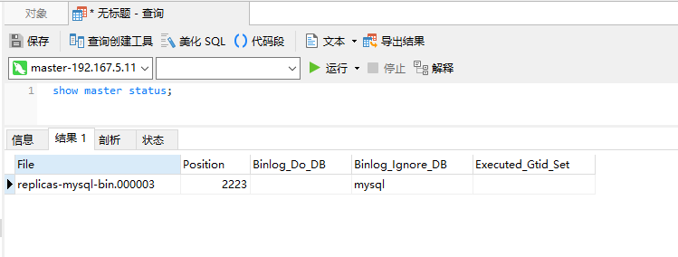

# MYSQL集群搭建

本项目使用docker compose来搭建mysql主从集群,mysql版本`5.7.17`

## 安装部署

```bash
# 下载此项目
git clone http://192.167.5.111:8888/env-build/mysql-cluster.git

cd mysql-cluster/

# 构建项目并运行
docker-compose up -d
```
## 链接数据库

分别查看主从数据库信息:

```sql
show master status;
```


## 从库配置主库信息

从库执行sql关联主库
```sql
CHANGE MASTER TO
    MASTER_HOST='mysql-master',
    MASTER_USER='root',
    MASTER_PASSWORD='root',
    MASTER_LOG_FILE='replicas-mysql-bin.000003',
    MASTER_LOG_POS=154;
```

重启从库服务
```sql
stop slave;
start slave;
```

## 检查

新建数据库和表,插入数据检查是否正常同步